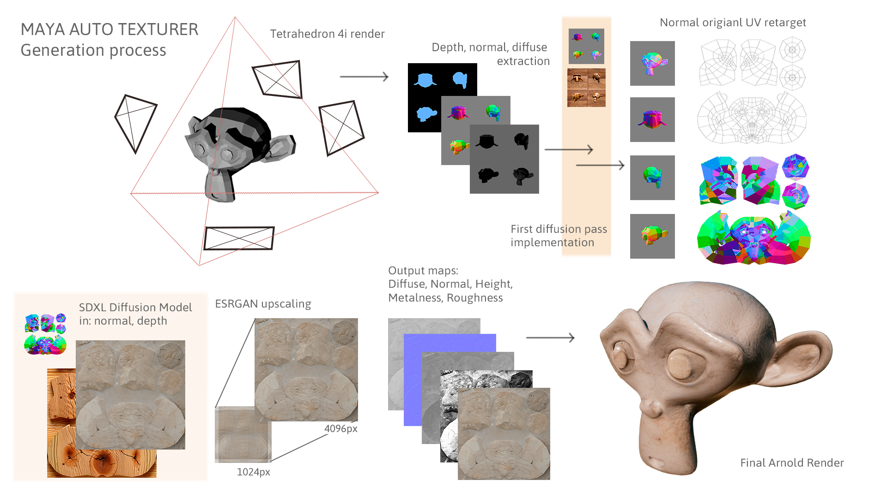
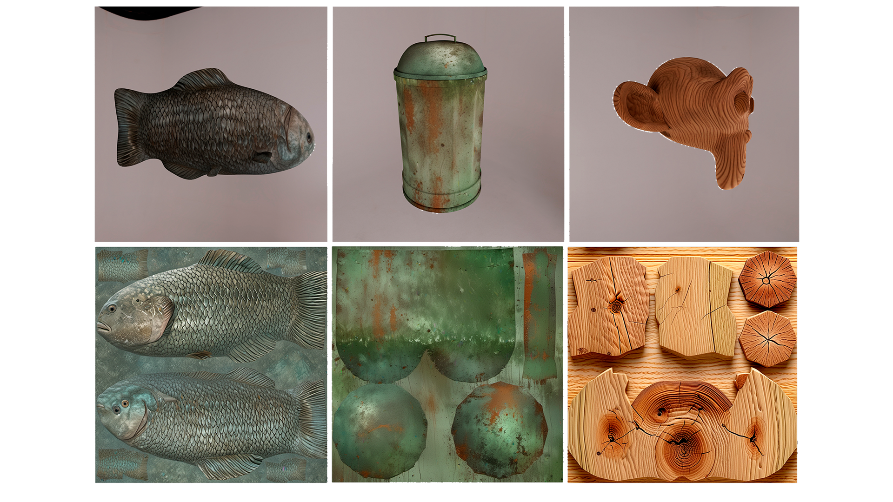

---

# AutoMayTex

**Diffusion texture generation for Autodesk Maya.** 

AutoMayTex renders a mesh (Depth and normal map) from multiple angles, feeds the renders into a Stable Diffusion XL ControlNet pipeline, and applies the resulting PBR texture maps back onto the mesh in maya.

---

## What It Does

AutoMayTex takes a selected Autodesk Maya mesh and runs an automated diffusion pipeline:

1. **Geometry Rendering** — Renders the mesh from 4 tetrahedral viewpoints into EXR tiles (normals + depth + RGBA).
2. **Collage Baking** — Tiles are packed into a 2×2 collage for efficient inference.
3. **Diffusion Generation** — The collage is sent to a local FastAPI server running a Stable Diffusion XL ControlNet model. The model generates diffuse, roughness, metalness, normal, and height maps guided by users prompt.
4. **UV Retargeting** — Generated tiles are re-projected back onto the mesh's original UV layout using planar UV baking.
5. **Material Assignment** — PBR maps are automatically wired into an Arnold/MaterialX/Standard Surface material and assigned to the object.

Everything is orchestrated from a PySide6 GUI inside Maya. The diffusion models inference runs in a separate Python venv to avoid conflicts with Maya's internal Python interpreter.

The backend server (`server/server.py`) runs inside a dedicated Python virtual environment with PyTorch + Diffusers. Maya communicates with it over HTTP on `localhost:8001`. The server is started automatically by the plugin when needed.

---

## Examples




https://github.com/user-attachments/assets/40cadb31-1cf1-4fbd-b2f8-e6a160cd76cc


---

## Installation

#### 1. Clone the repository

```bash
git clone https://github.com/danicasjau/automaytex.git
cd automaytex
```

#### 2. Create a Python virtual environment for the backend

Use a standalone Python 3.10–3.12 (not Maya's Python) to create the backend venv:

```bash
python -m venv mEnv
mEnv\Scripts\pip install --upgrade pip
mEnv\Scripts\pip install -r requirements.txt
```

> For CUDA GPU acceleration (strongly recommended), make sure you have CUDA 12.4+ installed. The `requirements.txt` points to the PyTorch CUDA wheels.

---

#### 4. Load the plugin in Maya

Open the **Maya Script Editor** and run:

```python
import maya.cmds as cmds
cmds.loadPlugin(r'to/my/path/automaytex.py')
cmds.automaytex()
```

To **reload** the plugin during development:

```python
import maya.cmds as cmds
cmds.unloadPlugin('automaytex.py')
cmds.loadPlugin(r'to/my/path/automaytex.py')
cmds.automaytex()
```

#### 5. Alternative: Add to Maya's plugin path

Instead of specifying the full path every time, add the plugin folder to Maya's plugin search path. In Maya's **Script Editor** run once:

```python
import maya.cmds as cmds
import os
os.environ["MAYA_PLUG_IN_PATH"] = r".\automaytex" # path to maya automaytex instalation folder
```

Or set `MAYA_PLUG_IN_PATH` permanently as a Windows environment variable, then reload Maya and find `automaytex.py` in **Plug-in Manager**.

---

## Loading AI Models

### From the GUI (Recommended)

1. Launch AutoMayTex via `cmds.automaytex()`.
2. Click **Advanced Model Settings**.
3. Go to the **Models** tab.
4. For each model, verify or change the **Install path**.
5. Click **Install / Download** on any missing model — the download runs in the background with a live progress bar.
6. Once all models are installed, go to the **Server** tab and click **Start Server**, then **Load Models**.

---

## Usage

1. Select a mesh in Maya.
2. Open the plugin: `cmds.automaytex()` (or via the Plug-in shelf).
3. Enter a **Positive Prompt** (e.g. `"rusted medieval iron armor, seamless, 8K"`).
4. Set the **Material Name** and optionally a custom **Output Path**.
5. Select which **Maps** to generate (Diffuse, Roughness, Metalness, Normal, Height).
6. Choose your **Model Type**. For `fast_sdxl`, use **Steps: 4** and **CFG: 2.0**.
7. Click **Generate Textures**.
8. The progress bar tracks each pipeline stage. A popup confirms when done.

---

## Requirements

- **Autodesk Maya** 2024 / 2025 / 2026 (PySide6)
- **NVIDIA GPU** with CUDA 12.4+ (strongly recommended; CPU supported but slow)
- **Python** 3.10 – 3.12 (standalone, for the backend venv)
- **Git for Windows** (for installer)
- ~**20 GB disk** for full model set

---

## Credits

AutoMayTex — v1.2.0  
Daniel Casadevall Jauhiainen, 2026
